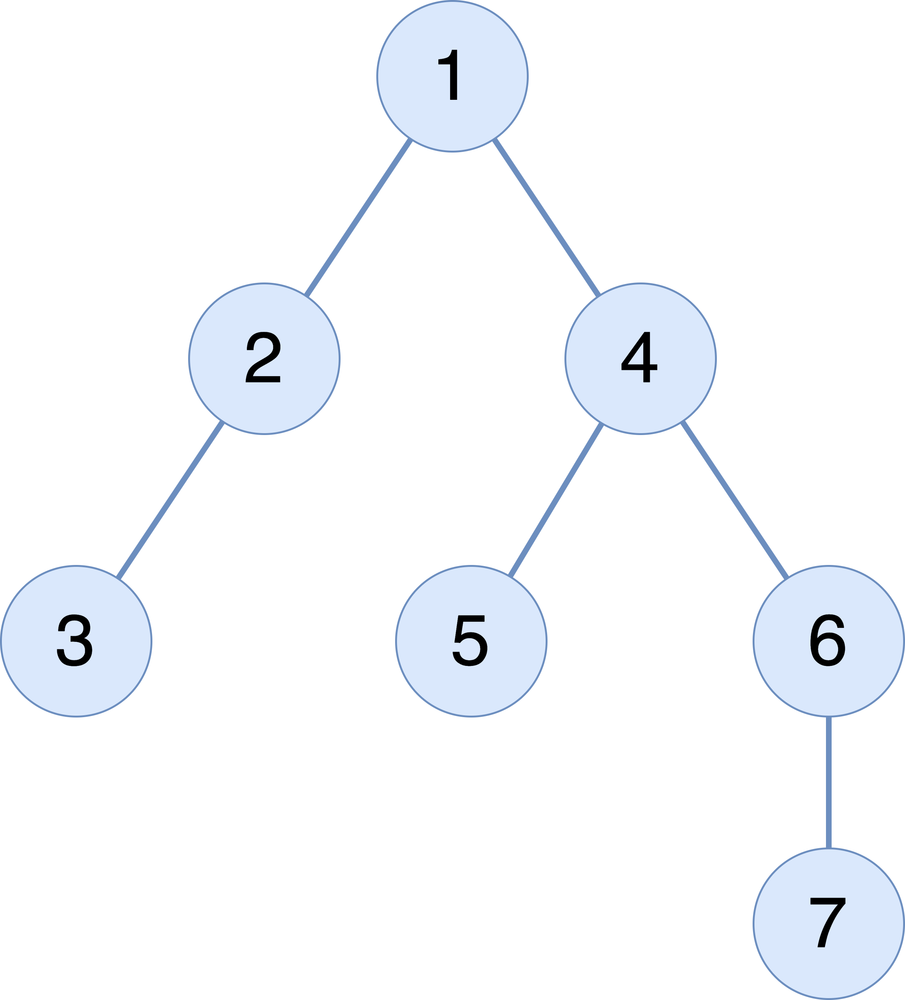

<div id="top"></div>


<!-- PROJECT SHIELDS -->
<!--
*** I'm using markdown "reference style" links for readability.
*** Reference links are enclosed in brackets [ ] instead of parentheses ( ).
*** See the bottom of this document for the declaration of the reference variables
*** for contributors-url, forks-url, etc. This is an optional, concise syntax you may use.
*** https://www.markdownguide.org/basic-syntax/#reference-style-links
-->
[![LinkedIn][linkedin-shield]][linkedin-url]


<!-- PROJECT LOGO -->
<br />
<div align="center"> 
    
</div>

<h3 align="center">A Spring Boot implementation of hierarchical data using the Closure Table pattern</h3>


<!-- TABLE OF CONTENTS -->
<details>
  <summary>Table of Contents</summary>
  <ol>
    <li>
      <a href="#intro">Introduction</a>
      <ul>
        <li><a href="#approach">Approach</a></li>
        <li><a href="#built-with">Built with</a></li>
      </ul>
    </li>
    <li>
      <a href="#getting-started">Getting Started</a>
      <ul>
        <li><a href="#installation">Installation</a></li>
      </ul>
    </li>
    <li><a href="#usage">Usage</a></li>
    <li>
      <a href="#future-work-and-limitations">Future work and limitations</a>
    </li>
    <li><a href="#contact">Contact</a></li>
    <li><a href="#acknowledgments">Acknowledgments</a></li>
  </ol>
</details>


<!-- ABOUT THE PROJECT -->
## Introduction

This project was a coding challenge conducted in connection with an interviewing process for a software engineering position.


**Context**:
We in Amazing Co need to model how our company is structured so we can do awesome stuff.We have a root node (only one) and several children nodes, each one with its own children as well. It's a tree-based structure. Something like:

``` 
       root
       /  \
      a    b
      |
      c

```

We need two HTTP APIs that will serve the two basic operations:
1. Get all descendant nodes of a given node (the given node can be anyone in the tree structure).
2. Change the parent node of a given node (the given node can be anyone in the tree structure).

They need to answer quickly, even with tons of nodes. Also, we can't afford to lose this information, so some sort of persistence is required.
Each node should have the following info:
1. node identification
2. who is the parent node
3. who is the root node
4. the height of the node. In the above example, height(root) = 0 and height(a) == 1.
<p align="right">(<a href="#top">back to top</a>)</p>

### Approach

To tackle the problem it is essential to analyze current solutions for persisting hierarchical data in relational databases. My research for this project made me look into four different approaches, each of which has its advantages and disadvantages. The following is a short summarization of the approaches and their characteristics. 

- Adjacency list
  - Each node stores a reference to its parent
  - Advantages:
    - Intuitive representation of the data
    - No data redundancy
    - Allows arbitrary depth
    - Fast and simple insert, move, and deletion since no additional nodes are affected.  
  - Disadvantages:
    - Difficult to retrieve ancestors, descendants, height, number of nodes (requires recursion).
    
* Nested sets
  * Each node stores a left value and a right value that can be used to search quickly anywhere in the tree 
  * Advantages:
    * Allows fast and simple operations for selecting nodes, ancestors, descendants.
  * Disadvantages:
    * Expensive insertion and modification since it may require updating all nodes in the tree.
    * No referential integrity

* Path enumeration
  * Each node stores the whole path from the root in a single field as a string.
  * Advantages:
    * Allows fast and simple operations for selecting nodes, ancestors, descendants.
  * Disadvantages:
    * Complicated modification of the tree as it may require to update all paths in all nodes.
    * Requires substring matching since the path is stored as a single field.
    * No referential integrity.
    * Depth levels are restricted by the maximum length of the path string.

* Closure table
  * Each nodes stores only its 'own' information. Parent-child relationships are stored in a second table. 
  * Advantages
    * Fast operations for selecting nodes, ancestors, and descendants.
    * Modifications are also fast.
  * Disadvantages:
    * Has the worst worst-case space complexity: O(n^2).
    * Data redundancy
    * Requires two tables
    * Complicated queries to ensure the integrity of the tree


<div align="center"> 
    <a href="https://www.slideshare.net/billkarwin/models-for-hierarchical-data">
    
    </a>
</div>

The Closure Table design was selected because it fulfills the requirements of the challenge, namely that it is able to query subtrees (descendants) efficiently. It is also able to efficiently modify the tree i.e. deleting, inserting, and changing parent (move subtree). However, the trade-off for this is inefficient space complexity.   

<p align="right">(<a href="#top">back to top</a>)</p>

### Built With

* Java
* Spring Boot
* Spring Data JPA
* Flyway for database migrations
* MySQL 8.0
* JUnit 5
* Lombok
* Maven

<p align="right">(<a href="#top">back to top</a>)</p>

<!-- GETTING STARTED -->
## Getting Started

To get this project up and running on your local machine follow these simple steps.

### Installation

To buld and run this project a MySQL server must be installed with the following:
* a MySQL user named `amazing` with password `amazing`
* An empty schema named amazing

The easiest way to obtain all of the above, and in addition to run the project is to utilize the docker-compose.yml file located at the root of this project.
Docker and docker-compose is required for this to work: (<a href="https://docs.docker.com/get-docker/">Install Docker</a>).

Simply execute the following command at the root of the project. This will expose the service on port 8080, and the database on port 3306.

  ```
  docker-compose --build
  ```

If you wish to build the project run the following command at the root of the project:

  ```
  mvn clean install
  ```
<p align="right">(<a href="#top">back to top</a>)</p>
<!-- USAGE EXAMPLES -->

## Usage

This project will pre-populate the database with the following tree:


### API Endpoints

**Get node**
```
curl http://localhost:8080/api/v1/node/1

{
  "id": 1,
  "parentId": null,
  "rootId": 1,
  "height": 0
}
```

**Change parent**
```
curl -X PUT -H "Content-Type: application/json" -d '{"parentId":"3"}' "http://localhost:8080/api/v1/node/7"

```

**Get descendants**

```
curl http://localhost:8080/api/v1/node/2/descendants

{
  "content": [
    {
      "id": 2,
      "parentId": 1,
      "rootId": 1,
      "height": 1
    },
    {
      "id": 3,
      "parentId": 2,
      "rootId": 1,
      "height": 2
    },
    {
      "id": 4,
      "parentId": 1,
      "rootId": 1,
      "height": 1
    },
    {
      "id": 5,
      "parentId": 4,
      "rootId": 1,
      "height": 2
    },
    {
      "id": 6,
      "parentId": 4,
      "rootId": 1,
      "height": 2
    },
    {
      "id": 7,
      "parentId": 6,
      "rootId": 1,
      "height": 3
    }
  ],
  "pageable": {
    "sort": {
      "empty": true,
      "sorted": false,
      "unsorted": true
    },
    "offset": 0,
    "pageNumber": 0,
    "pageSize": 20,
    "paged": true,
    "unpaged": false
  },
  "totalPages": 1,
  "totalElements": 6,
  "last": true,
  "size": 20,
  "number": 0,
  "sort": {
    "empty": true,
    "sorted": false,
    "unsorted": true
  },
  "numberOfElements": 6,
  "first": true,
  "empty": false
}

 ```
**Create node**
```
curl -X POST -H "Content-Type: application/json" -d '{"id":"786", "parentId":"1", "rootId":"1"}' "http://localhost:8080/api/v1/node"

{
  "id": 786,
  "parentId": 1,
  "rootId": 1,
  "height": 1
}
```

<p align="right">(<a href="#top">back to top</a>)</p>

## Future work and limitations

If I were to spend more time on this, I would:
- Configure different profiles for different environment (when needed).
- Configure a separate database for testing (For example with H2).
- Create API documentation e.g. using Swagger
- Write more tests. Currently, all features of the NodeService has been tested via. unit testing. This could be improved by also creating tests for the NodeRepository, and then mocking this in the NodeServiceTest. Also, I would implement Integrations tests.
- Add endpoints for full CRUD functionality.
- Currently, this solution returns the descendants using pagination. This is to mitigate the scenario where a large data set is requested and loaded into memory, which may potentially result in exhausting both client and server resources. 
  - For more efficient use of resources one could look into implementing this using e.g. Spring Webflux. This may allow streaming large data sets in chunks, and more efficient use of resources. 


<!-- CONTACT -->
## Contact

Fahad Ali Sajad - [@LinkedIn](https://www.linkedin.com/in/fahad-ali-sajad-380a25127) - Fahadalisajad@hotmail.com

<p align="right">(<a href="#top">back to top</a>)</p>


<!-- ACKNOWLEDGMENTS -->
## Acknowledgments

Resources from which I have been inspired while implementing this project:

* [What is the most efficient/elegant way to parse a flat table into a tree?](https://stackoverflow.com/questions/192220/what-is-the-most-efficient-elegant-way-to-parse-a-flat-table-into-a-tree/192462#192462)
* [Models for #Hierarchical Data in #SQL and PHP - Bill Karwin - #MySQL Tutorial](https://www.youtube.com/watch?v=wuH5OoPC3hA)
* [Moving Subtrees in Closure Table Hierarchies](https://www.percona.com/blog/2011/02/14/moving-subtrees-in-closure-table/)
* [Closure Table operations SQL fragments](https://gist.github.com/emmanuel/1004087)
* [Storing trees in databases](https://makandracards.com/makandra/45275-storing-trees-in-databases)
* [Storing trees in RDBMS](https://bitworks.software/en/2017-10-20-storing-trees-in-rdbms.html)
* [Restful API - handling large amounts of data](https://stackoverflow.com/questions/11725078/restful-api-handling-large-amounts-of-data)

<p align="right">(<a href="#top">back to top</a>)</p>

[linkedin-shield]: https://img.shields.io/badge/-LinkedIn-black.svg?style=for-the-badge&logo=linkedin&colorB=555
[linkedin-url]: https://www.linkedin.com/in/fahad-ali-sajad-380a25127/
[product-screenshot]: images/screenshot.png
